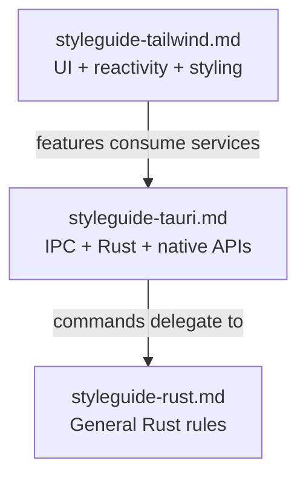
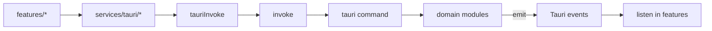

# Tauri Desktop Style Guide

Conventions for building the native desktop boundary in Tauri v2 apps with a SolidJS frontend — Rust commands, typed IPC, capabilities, and frontend service wrappers.

See also: [SolidJS UI Style Guide](./styleguide-tailwind.md) for frontend UI, reactivity, and styling; [Rust Style Guide](./styleguide-rust.md) for general Rust rules.

This guide owns **IPC and the native boundary only**. UI components, context stores, accessibility, and TanStack Query consumption patterns live in the Tailwind guide.

## Core Principles

- Tauri is the **desktop boundary** — all native I/O goes through Rust commands or official Tauri plugins
- Commands stay **thin** (< 30 LOC); business logic lives in domain modules (`db/`, `commands/` delegates to `<domain>/`)
- **Explicit registration** — every command is listed in `generate_handler!` in `src-tauri/src/lib.rs`; no auto-discovery
- **Hand-maintained types** — no specta/ts-rs unless a project adopts it; Rust serde types and TypeScript DTOs must stay in sync manually
- **StableError** is the only error shape across the IPC boundary (`{ code, message }`, camelCase)
- **Pull via invoke, push via events** — queries and mutations use commands; long-running work and live updates use `app.emit` / `listen`
- Features never call `invoke` directly — always go through `src/services/tauri/*`
- Use `@ur-wesley/ts-prelude/result` for fallible service boundaries on the frontend

## Guide Relationships



## IPC Flow



## Tech Stack

### Tauri v2

- Desktop shell with Rust backend (`src-tauri/`) and SolidJS frontend (`src/`)
- Binary entry in `main.rs` delegates to `<crate>_lib::run()` in `lib.rs`
- All application wiring — plugins, managed state, `setup`, command registration — lives in `lib.rs`

### Frontend boundary (SolidJS)

- SolidJS for UI — see [Tailwind guide](./styleguide-tailwind.md)
- TanStack Query for async/server state in features — not in `services/tauri/` or `components/ui`
- `@ur-wesley/ts-prelude/result` for `ResultAsync` in invoke wrappers

### Build and dev (stack defaults)

- **Bun** for frontend tooling — never `npm run` or `pnpm`
- Dev: `bun tauri dev`
- Build: `bun tauri build`
- Version sync across `package.json`, `src-tauri/Cargo.toml`, and `src-tauri/tauri.conf.json` via bumpp

Per-repo tooling may differ — see [Project Overrides](#project-overrides).

### Tauri plugins (enable only what the app needs)

| Category | Examples | Typical use |
| --- | --- | --- |
| Core platform | `fs`, `dialog`, `shell`, `process`, `os`, `opener` | Files, dialogs, subprocesses |
| Persistence | `sql`, `store` | Database, key-value settings |
| Desktop UX | `clipboard`, `global-shortcut`, `notification`, `autostart`, `window-state` | OS integration |
| Distribution | `updater`, `deep-link`, `single-instance` | Updates, URL schemes, single instance |
| Security | `persisted-scope` | Persist FS scope grants across restarts |

Plugin config lives in `src-tauri/tauri.conf.json`. Register plugins in `lib.rs` via `.plugin(...)`.

## Project Structure

### Rust backend (`src-tauri/`)

```
src-tauri/
  src/
    lib.rs              # App wiring: plugins, state, setup, generate_handler!
    main.rs             # Thin binary entry
    error.rs            # StableError, AppError, codes
    models.rs           # Shared DTOs and emit helpers
    commands/           # Thin #[tauri::command] handlers per domain
    db/                 # Database access (if using tauri-plugin-sql)
    <domain>/           # Business logic modules (auth, sync, files, etc.)
  capabilities/         # Per-window permission JSON
  migrations/           # SQL migration files (if using sql plugin)
```

Large domains may split `commands/` into subfolders with `mod.rs` re-exports. Commands tightly coupled to a subsystem may live in `<domain>/commands.rs` — still registered in `lib.rs`.

### Frontend services (`src/`)

```
src/
  services/tauri/       # One module per domain — invoke wrappers
  services/tauri/utils.ts  # tauriInvoke gateway
  types/dto.ts          # Shared DTOs (hand-synced with Rust)
  types/error.ts        # StableError type
  lib/invoke-error.ts   # User-facing error messages (i18n)
  lib/event-hub-context.tsx  # In-app UI event bus (not Tauri)
```

One service file per domain (`settings`, `items`, `files`, etc.). No barrel `index.ts` — import directly from the domain file.

## Layer Boundaries

| Layer | May import | Must not import |
| --- | --- | --- |
| `features/*` | `services/tauri/*`, `types/*`, `components/ui`, `lib/*` | `@tauri-apps/api` directly (except rare plugin UI) |
| `services/tauri/*` | `types/*`, `./utils`, `@tauri-apps/api/core`, `@ur-wesley/ts-prelude/result` | `features/*`, `components/ui` |
| `components/ui` | `lib/*`, `utils/*` | `services/tauri/*`, `features/*` |
| `commands/*` (Rust) | `db/`, `models`, domain modules | Heavy logic inline in command fn |
| Domain modules (Rust) | `error`, `models`, other domain modules | Frontend types |

Rules:

- Features call domain functions (`getItem()`, `saveSettings()`) — never `tauriInvoke` or `invoke`
- Commands delegate to domain modules — never contain business logic beyond arg mapping
- Shared DTOs live in `models.rs` (Rust) and `types/dto.ts` (TS); co-locate command-only input structs with the command

## Rust Backend Conventions

General Rust rules (file size, import order, platform isolation, async) are in [styleguide-rust.md](./styleguide-rust.md). This section covers Tauri-specific patterns only.

### Entry Point

`main.rs` is minimal — Windows release subsystem attribute and a call to the library crate:

```rust
#![cfg_attr(not(debug_assertions), windows_subsystem = "windows")]

fn main() {
    my_app_lib::run()
}
```

All wiring happens in `lib.rs::run()`: plugin chain, `.manage()` state, `setup` closure, and `generate_handler!`.

### Commands

One module per domain under `commands/`. Large domains split into subfolders (e.g. `commands/items/` with `mod.rs` re-exports).

```rust
#[tauri::command]
pub async fn get_item(id: String, db: State<'_, DbPool>) -> Result<ItemDto, StableError> {
    db::get_item(&db, &id).await
}
```

Rules:

- `#[tauri::command]` on `pub async fn` (sync only when truly synchronous)
- Return `Result<T, StableError>`
- Inject deps via `State<'_, T>`, `AppHandle`, or `Manager`
- Input payloads: local `#[derive(Deserialize)]` structs with `#[serde(rename_all = "camelCase")]`
- Shared response types: `crate::models::*` with `*Dto` suffix
- Register every new command in `lib.rs` `generate_handler![...]`

### Managed State

Register via `.manage()` in `lib.rs`:

```rust
.manage(AppState::default())
.manage(Arc::new(Mutex::new(ConnectionPool::new())))
```

Patterns:

- Wrapper structs around `Arc<Mutex<...>>` or `Arc<RwLock<...>>` for shared mutable state
- Access in commands via `State<'_, T>` injection or `app.try_state::<T>()`
- Plugin-provided state: e.g. `State<'_, DbInstances>` from `tauri-plugin-sql`
- State needed only after setup: register in the `setup` closure
- Desktop-only state types get empty `Default` stubs on mobile so the crate compiles cross-platform

### Platform Gating

```rust
#[cfg(not(any(target_os = "android", target_os = "ios")))]
mod desktop_only;
```

Isolate `#[cfg(windows)]`, `#[cfg(target_os = "macos")]`, `#[cfg(unix)]` into dedicated modules — never inline `#[cfg]` blocks inside shared functions.

## Frontend Service Conventions

### Invoke Gateway

All standard commands go through `tauriInvoke` in `services/tauri/utils.ts`:

```ts
import { invoke } from "@tauri-apps/api/core";
import { ResultAsync } from "@ur-wesley/ts-prelude/result";
import type { StableError } from "~/types/error";

export function mapInvokeError(e: unknown): StableError {
  if (
    e !== null &&
    typeof e === "object" &&
    "code" in e &&
    "message" in e &&
    typeof (e as StableError).code === "string" &&
    typeof (e as StableError).message === "string"
  ) {
    return e as StableError;
  }
  return { code: "INVOKE_FAILED", message: String(e) };
}

export function tauriInvoke<T>(cmd: string, args?: Record<string, unknown>): ResultAsync<T, StableError> {
  return ResultAsync.fromPromise(invoke<T>(cmd, args), (e) => {
    console.error("[tauriInvoke] error for cmd:", cmd, "error:", e);
    return mapInvokeError(e);
  });
}
```

### Domain Module Pattern

```ts
import type { ItemDto } from "~/types/dto";
import { tauriInvoke } from "./utils";

export function listItems() {
  return tauriInvoke<ItemDto[]>("list_items");
}

export function getItem(id: string) {
  return tauriInvoke<ItemDto>("get_item", { id });
}

export function saveItem(payload: SaveItemPayload) {
  return tauriInvoke<ItemDto>("save_item", { payload });
}
```

Rules:

- camelCase TS function name maps to snake_case Rust command name
- Always return `ResultAsync<T, StableError>` — never bare `Promise`
- Import shared DTOs from `~/types/dto`; define domain-local types in the service file
- Use `ReturnType<typeof tauriInvoke<T>>` when re-exporting for consistency

### Argument Shapes

Must match the Rust `#[tauri::command]` signature exactly:

| Pattern | TS | Rust |
| --- | --- | --- |
| Flat | `{ id }`, `{ name }` | `id: String` as param |
| Wrapped payload | `{ payload }` | `payload: SomePayload` |
| Wrapped input | `{ input }` | `input: SomeInput` |
| Wrapped args | `{ args }` | `args: SomeArgs` |

When adding a command, check the Rust signature and mirror the arg shape in the TS wrapper.

### Plugin API Wrappers

Tauri plugin APIs that are not Rust commands may be wrapped with `ResultAsync.fromPromise` + `mapInvokeError`:

```ts
import { ResultAsync } from "@ur-wesley/ts-prelude/result";
import { isEnabled, enable } from "@tauri-apps/plugin-autostart";
import { mapInvokeError } from "./utils";

export function getAutostartEnabled() {
  return ResultAsync.fromPromise(isEnabled(), mapInvokeError);
}
```

### Known Exceptions

| Pattern | When |
| --- | --- |
| Fire-and-forget + `isTauri()` guard | OS notifications and other non-recoverable side effects |
| `ResultAsync.fromPromise` on plugin API | Not a Rust command |
| Raw `invoke` in isolated subsystems | Legacy or plugin bridges — do not extend for new commands |

## Type Definitions

No codegen by default. Types are hand-maintained and must stay in sync between Rust and TypeScript.

### Shared DTOs

- Rust: `src-tauri/src/models.rs` — `#[derive(Serialize, Deserialize)]` with `#[serde(rename_all = "camelCase")]`
- TypeScript: `src/types/dto.ts` — matching interfaces/types

### IDE candidate icons (`IdeCandidateDto`)

Discovered IDEs expose two icon fields:

| Field | Source | UI usage |
| --- | --- | --- |
| `icon` | Iconify class fallback (e.g. `devicon-plain--vscode`) | `<span class={cn("iconify", icon)} />` when native extract fails |
| `iconData` | Native OS icon as `data:image/png;base64,…` (or SVG on Linux) | `` — **prefer this** |

Rust fills `iconData` in `src-tauri/src/ide/icon.rs` during discovery (`push_candidate`). Windows uses `IShellItemImageFactory::GetImage` (256×256) with `ExtractIconExW` fallback; shim paths (`.cmd` / `.bat`) resolve to the real `.exe` first. Extraction failures return `null` — never surface errors to the user.

Frontend: project detail header and Tools settings already branch on `iconData` before `icon`. Keep Iconify safelist entries in `StackIconSafelist.tsx` for fallbacks only.

### Error Type

```ts
// src/types/error.ts
export type StableError = {
  code: string;
  message: string;
};
```

Mirrors `StableError` in `src-tauri/src/error.rs`.

### Emit Payloads

Rust: `*Emit` structs in `models.rs` (e.g. `ItemUpdatedEmit`). TypeScript: define matching types at the `listen` call site or in a shared types file when reused.

### Command-Only Inputs

Co-locate with the command in Rust (`SaveItemPayload` in `commands/items.rs`). Mirror in TS only if the service file needs an explicit type — otherwise inline in the wrapper call.

## Error Handling

### Rust

Two-layer model in `error.rs`:

| Layer | Type | Role |
| --- | --- | --- |
| Frontend contract | `StableError` | Serializable `{ code, message }`, camelCase |
| Internal | `AppError` | `thiserror` enum with `From<AppError> for StableError` |
| Codes | `error::codes::*` | Stable string constants (`"DB_ERROR"`, `"NOT_FOUND"`, etc.) |

Rules:

- Commands return `Result<T, StableError>`
- Use `StableError::new(codes::NOT_FOUND, "…")` or `?` from lower layers
- Use `AppError` in domain modules; convert at the command boundary via `?` or `.into()`
- Never construct `StableError` with ad hoc string codes — use `codes::*` constants
- Add new codes to `error::codes` and matching i18n keys (`errors.<CODE>`) in locale files

### Frontend

Service layer returns `ResultAsync<T, StableError>`. Consumers branch with `isOk()` / `isErr()`.

User-facing messages via `stableErrorMessage(t, err)` in `lib/invoke-error.ts` — maps `errors.<code>` i18n keys with optional detail suffix.

### Consumption in Features

TanStack Query integration and mutation error handling follow the [Tailwind guide](./styleguide-tailwind.md) async data section. Summary:

- **`queryFn`** — `await` service call; throw on `isErr()` to surface query error state
- **`mutationFn`** — throw `StableError`; handle in `onError` with `stableErrorMessage`
- **Imperative UI** — direct `isOk` / `isErr` branching
- **Fire-and-forget** — `mapErr` without awaiting
- **Soft failure** — return empty/default on error when appropriate

Never `throw` across the IPC boundary from Rust — return `StableError` from commands.

## Events

### Two Event Systems

| System | API | When |
| --- | --- | --- |
| **Tauri backend events** | `app.emit` / `listen` from `@tauri-apps/api/event` | Rust pushes updates to frontend (progress, streaming I/O, cache invalidation) |
| **Frontend event hub** | `~/lib/event-hub-context` `hub.emit` | In-app UI coordination only — no Rust round-trip |

Do not use the frontend hub for data that originates in Rust. Do not use Tauri events for pure UI coordination.

### Event Naming

Use `namespace:action` or `namespace:kebab-detail`:

- `item:updated`
- `sync:progress`
- `job-state-changed`

Prefer colons for domain namespaces; hyphens within multi-word actions.

### Rust Emission

Import `tauri::Emitter`:

```rust
#[derive(Debug, Clone, Serialize)]
#[serde(rename_all = "camelCase")]
pub struct ItemUpdatedEmit {
    pub id: String,
    pub change_type: String,
}

pub fn emit_item_updated(app: &AppHandle, id: &str, change_type: &str) {
    let _ = app.emit(
        "item:updated",
        ItemUpdatedEmit {
            id: id.to_string(),
            change_type: change_type.to_string(),
        },
    );
}
```

Rules:

- Fire-and-forget: `let _ = app.emit("event-name", payload);`
- Structured payloads: dedicated `*Emit` structs with `#[serde(rename_all = "camelCase")]`
- Cross-cutting emits: helper functions in `models.rs`
- When emit failure should fail the command: `.map_err(|e| StableError::new(codes::INTERNAL, e.to_string()))?`

### Frontend Listening

```ts
import { listen } from "@tauri-apps/api/event";
import { onCleanup, onMount } from "solid-js";

onMount(() => {
  const unlistens: (() => void)[] = [];

  void listen<ItemUpdatedEmit>("item:updated", (e) => {
    // handle payload
  }).then((fn) => unlistens.push(fn));

  onCleanup(() => {
    for (const fn of unlistens) fn();
  });
});
```

Rules:

- Type payloads: `listen<PayloadType>("event-name", handler)`
- Always `unlisten()` in `onCleanup` or `finally`
- Filter by entity id in scoped listeners (e.g. `e.payload.id !== currentId`)
- For progress streaming: subscribe for the duration of the operation, `unlisten()` in `finally`
- Global invalidation listeners belong at app root or in a dedicated hook; scoped listeners in feature model hooks

## Capabilities and Security

Capabilities auto-load from `src-tauri/capabilities/`. Not defined inline in `tauri.conf.json`.

### Per-Window Permissions

| Pattern | Purpose |
| --- | --- |
| `default.json` | Main window — broad app permissions |
| `desktop.json` | Platform-specific extras (autostart, window-state) |
| `<window>.json` | Secondary windows — minimal permissions only |

### Filesystem Scope

Static allow in capability JSON for app dirs:

```json
{
  "identifier": "fs:scope",
  "allow": ["$APPLOCALDATA/**", "$APPCONFIG/**", "$RESOURCE/**"]
}
```

Extend at runtime when the user grants access to paths outside app dirs:

```rust
pub fn allow_user_path(app: &AppHandle, path: &Path) -> Result<(), StableError> {
    app.fs_scope()
        .allow_directory(path, true)
        .map_err(|e| StableError::new(codes::INTERNAL, e.to_string()))
}
```

Persist grants via `tauri-plugin-persisted-scope` when the app needs remembered access.

### Adding Permissions

When a new command or plugin needs a capability not yet granted:

1. Add the permission to the appropriate capability JSON file
2. Use the most restrictive window scope (secondary windows get minimal files)
3. Prefer runtime scope extension over broad static allows for user paths

## Plugins

### Official Tauri Plugins

Registered in `lib.rs` via `.plugin(...)`. Config in `tauri.conf.json` under `"plugins"`.

Frontend plugin APIs may be wrapped in `services/tauri/` using `ResultAsync.fromPromise` + `mapInvokeError` when they are not Rust commands.

### Optional Extension Subsystems

Some apps add custom plugin runtimes (scripting, WASM, etc.). These are project-specific:

- Keep extension commands in a dedicated module
- Use a namespaced event prefix (`extension:action`)
- Document the subsystem in the repo's project overrides — not in this guide

## Adding a New Command

1. **Domain logic** — implement in the appropriate module (`db/`, `<domain>/`, etc.)
2. **DTOs** — add shared types to `models.rs` and `types/dto.ts` (or co-locate input structs with the command)
3. **Command** — add `#[tauri::command]` in `commands/<domain>.rs`
4. **Export** — add module to `commands/mod.rs` if new file
5. **Register** — add to `generate_handler![...]` in `lib.rs`
6. **Error codes** — add to `error::codes` and i18n `errors.<CODE>` if new failure modes
7. **Frontend wrapper** — add function in `services/tauri/<domain>.ts` using `tauriInvoke`
8. **Capabilities** — update `capabilities/*.json` if new plugin permission needed
9. **FS scope** — call runtime scope extension if accessing new user paths
10. **Events** — if frontend needs push updates, emit via `app.emit` and add typed `listen` with cleanup

## Naming

### Rust

| Item | Convention | Example |
| --- | --- | --- |
| Command fns | `snake_case` | `get_item`, `save_settings` |
| DTOs | `PascalCase` + `Dto` | `ItemDto`, `SettingsDto` |
| Emit payloads | `PascalCase` + `Emit` | `ItemUpdatedEmit`, `SyncProgressEmit` |
| Command inputs | `PascalCase` + `Payload` / `Input` | `SaveItemPayload`, `EnableFeatureInput` |
| Serde JSON | `camelCase` | `#[serde(rename_all = "camelCase")]` |
| Error codes | `SCREAMING_SNAKE` strings | `codes::NOT_FOUND` → `"NOT_FOUND"` |
| Events | `namespace:kebab-action` | `item:updated`, `sync:progress` |
| Modules | `snake_case` | `file_watcher`, `settings` |

### TypeScript

| Item | Convention | Example |
| --- | --- | --- |
| Service functions | `camelCase` | `getItem`, `saveSettings` |
| Rust command names | `snake_case` (in `tauriInvoke` string) | `"get_item"` |
| DTOs | `PascalCase` + `Dto` | `ItemDto` |
| Service files | `kebab-case` or domain name | `file-watcher.ts`, `settings.ts` |

## Dev and Release

Stack defaults:

- **Dev:** `bun tauri dev`
- **Lint/typecheck before release:** per repo scripts
- **Release:** bumpp syncs version across `package.json`, `Cargo.toml`, `tauri.conf.json`
- **CI:** tag push triggers build; updater endpoint in `tauri.conf.json` if using auto-update

See [Project Overrides](#project-overrides) for repo-specific release workflows.

## Project Overrides

This guide states **stack defaults**. Each repo may diverge. Before implementing, read these files in order (skip missing):

1. `package.json` — package manager, scripts, stack deps
2. `src-tauri/tauri.conf.json` — plugins, windows, deep links, updater
3. `src-tauri/capabilities/*.json` — actual permissions per window
4. `src-tauri/Cargo.toml` — Rust dependencies
5. `ai/styleguide-rust.md` — repo-specific Rust rules
6. `ai/styleguide-tailwind.md` — repo-specific UI rules
7. `bump.config.ts` / `docs/RELEASE.md` — release workflow

Summarize in chat: aligned, missing, divergent. Repo-specific domain modules, event names, and plugin choices belong in the repo — not in this guide.

## Do / Don't

### Do

- keep commands thin — delegate to domain modules
- register every command explicitly in `generate_handler!`
- return `Result<T, StableError>` from all commands
- use `codes::*` constants for error codes
- wrap every new command in `services/tauri/<domain>.ts` via `tauriInvoke`
- keep Rust DTOs and TS types in sync manually
- use `listen<T>(...)` with typed payloads and `unlisten()` cleanup
- extend FS scope at runtime when user grants paths
- use `stableErrorMessage(t, err)` for user-visible errors
- consume services via TanStack Query in features (see Tailwind guide)
- gate desktop-only code with `#[cfg]` module isolation
- use official Tauri plugins for platform APIs
- use `@ur-wesley/ts-prelude/result` for service-layer error handling

### Don't

- call `invoke` directly from features (except documented legacy/plugin bridges)
- import `@tauri-apps/api` in `components/ui`
- put business logic in command handlers
- construct `StableError` with ad hoc code strings
- use the frontend event hub for Rust-originated data
- skip command registration in `lib.rs`
- add broad FS scope allows for user paths in static capability JSON
- block the Tauri command thread with synchronous I/O
- use `npm run` or `pnpm` when Bun is the project package manager
- throw across the IPC boundary from Rust — return `StableError`
- duplicate DTO definitions without syncing both sides
- repeat UI, styling, or accessibility rules — defer to the Tailwind guide
